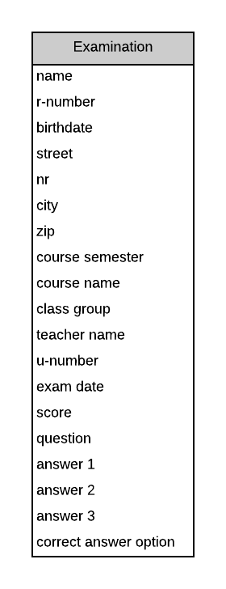

# Normalization and ER-diagram

Take a look at the following ER diagram.

The ER-diagram describes a possible database design for managing students, examinations and scores. The database design is not normalized. Try to normalize this database to NF2 (if possible you can also try to get it in NF3).

Describe the steps you need to follow to get the database in NF1, NF2 and NF3 in the following chapters.

## Normalizing the database

### Converting to the first normal form (NF1)

<!-- TODO: describe the steps you followed and show the resulting ER diagram -->

### Converting to the first normal form (NF2)

<!-- TODO: describe the steps you followed and show the resulting ER diagram -->

### Converting to the first normal form (NF3) (optional)

<!-- TODO: describe the steps you followed and show the resulting ER diagram -->

## ER-diagrams

For the normalized database, create an **conceptual**, **logical** and **physical** ER diagram.

### Conceptual ER-diagram

<!-- TODO: Place your solution image here -->

### Logical ER-diagram

<!-- TODO: Place your solution image here -->

### Physical ER-diagram

<!-- TODO: Place your solution image here -->

## Reflection on the Assignment
<!-- Fill out all the questions below by replacing the TODO comments. Do not remove the other markdown. Make sure to answer EACH question. -->
**What is working and what is not?**
<!-- TODO: Fill out this question -->

**Was the assignment to hard or to easy? What was too hard or what was too easy**
<!-- TODO: Fill out this question -->

**For what part of the assignment did you need to do some research? (for example Google search)**
<!-- TODO: Fill out this question -->

**How much time did you approximately spend on this assignment (excluding time of report)?**
<!-- TODO: Fill out this question -->

**Is there any code you copied from someone else or from the Internet? Provide the source here (author, website, ...). Also explain what you changed to the source code.**
<!-- TODO: Fill out this question -->

**Is there a piece of code that you are not satisfied with. Place it here and describe what you think is wrong with it.**
<!-- TODO: Fill out this question -->

## Need to knows and remarks
<!--
Here you should place extra remarks that the teacher needs to know to get the solution working. For example if one needs to change some configuration file or install some extra libraries or whatever. There is also room for extra remarks you would like to make that you were not able to fit inside one of the sections above.
-->
